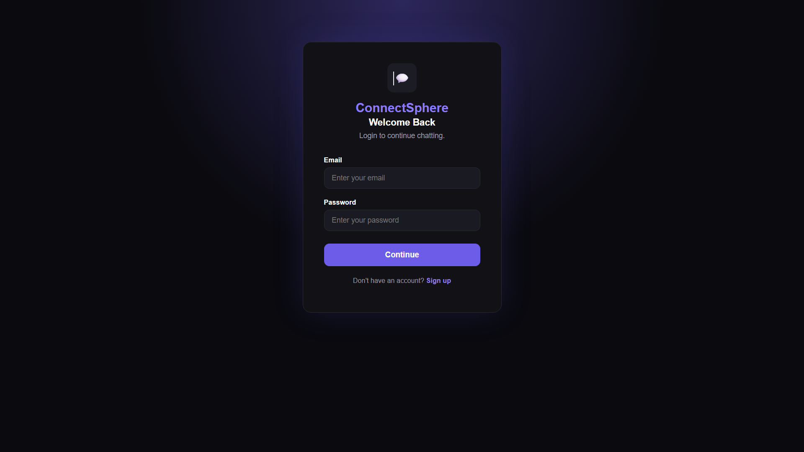
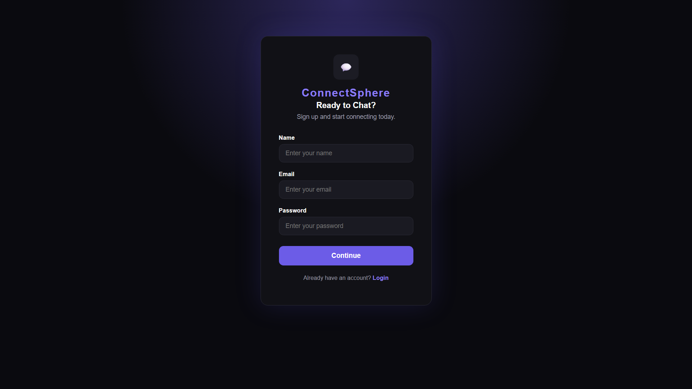
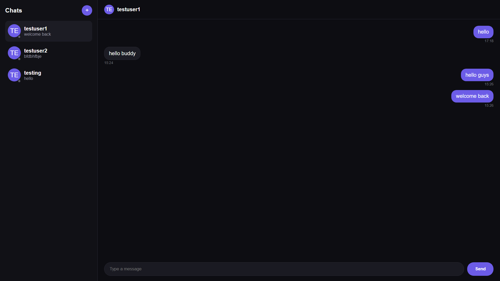

# ConnectSphere 💬

A real-time full-stack chat application built with the MERN stack, featuring live messaging, presence tracking, and a sleek Discord-inspired dark theme.


---

## ✨ Features

- 🔐 **Authentication** — Secure signup/login with JWT-based auth and password hashing
- ⚡ **Real-Time Messaging** — Instant message delivery powered by Socket.IO
- 🟢 **Online/Offline Presence** — Live status indicators for all users
- ✍️ **Typing Indicators** — See when someone's typing in real time
- 💬 **WhatsApp-Style Chat List** — Familiar, intuitive conversation sidebar
- 🎨 **Custom Avatars** — Auto-generated unique avatars via DiceBear
- 🌙 **Dark Theme** — Discord/purple-inspired UI for a modern feel
- 🗄️ **Persistent Storage** — All chats and messages saved with MongoDB

---

## 🛠️ Tech Stack

**Frontend**
- React.js
- Socket.IO Client
- Tailwind CSS / CSS Modules
- DiceBear Avatars API

**Backend**
- Node.js + Express.js
- Socket.IO (WebSocket server)
- MongoDB + Mongoose
- JWT for authentication

---

## 📂 Project Structure

```
ConnectSphere/
├── client/                 # React frontend
│   ├── src/
│   │   ├── components/
│   │   ├── pages/
│   │   ├── context/
│   │   └── App.jsx
│   └── package.json
├── server/                 # Express backend
│   ├── controllers/
│   ├── models/
│   ├── routes/
│   ├── socket/
│   ├── middleware/
│   └── server.js
└── README.md
```

---

## 🚀 Getting Started

### Prerequisites
- Node.js (v18+)
- MongoDB (local or Atlas)

### Installation

1. Clone the repository
   ```bash
   git clone https://github.com/harshiiii18/ConnectSphere.git
   cd ConnectSphere
   ```

2. Install dependencies
   ```bash
   cd server && npm install
   cd ../client && npm install
   ```

3. Set up environment variables

   Create a `.env` file inside `/server`:
   ```env
   PORT=5000
   MONGO_URI=your_mongodb_connection_string
   JWT_SECRET=your_jwt_secret
   ```

4. Run the app
   ```bash
   # In /server
   npm run dev

   # In /client
   npm run dev
   ```

5. Open [http://localhost:5173](http://localhost:5173) in your browser 🎉

---

## 🗺️ Roadmap

- [x] JWT authentication
- [x] Real-time messaging with Socket.IO
- [x] Online/offline presence tracking
- [x] Typing indicators
- [x] WhatsApp-style chat list UI
- [ ] Message filtering between specific users
- [ ] Group chats
- [ ] Media/file sharing
- [ ] Message read receipts
- [ ] Deployment (Vercel + Render)

---

## 📸 Screenshots

## Login page


## Signup page


## Dashboard



---

## 🤝 Contributing

This is currently a solo portfolio project, but suggestions and issues are welcome!

---

## 📄 License

This project is licensed under the MIT License.

---

## 👩‍💻 Author

**Harshita Parsendiya**
- GitHub: [@harshiiii18](https://github.com/harshiiii18)
- LinkedIn: [Harshita Parsendiya](https://linkedin.com/in/harshita-parsendiya-161252334)